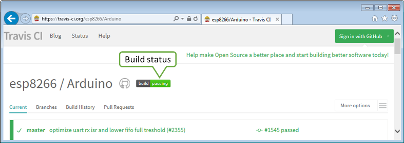
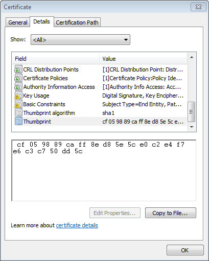

[ESP8266WiFi Library :back:](readme.md#client-secure)


## Client Secure

The client secure is a [client](#client) but secure. Application example below will be easier to follow if you check similar and simpler [example](client-examples.md) for the "ordinary" client. That being said we will concentrate on discussing the code that is specific to the client secure.


## Table of Contents
  * [Introduction](#introduction)
  * [The Sketch](#the-sketch)
  * [How to Verify Server's Identity?](#how-to-verify-server-s-identity)
  * [Get the Fingerprint](#get-the-fingerprint)
  * [Connect to the Server](#connect-to-the-server)
  * [Is it THAT Server?](#is-it-that-server)
  * [GET Response from the Server](#get-response-from-the-server)
  * [Read and Check the Response](#read-and-check-the-response)
  * [Does it Work?](#does-it-work)
  * [Conclusion](#conclusion)


### Introduction

In this example we will be retrieving information from a secure server https://api.github.com. This server is set up in place to provide specific and structured information on [GitHub](https://github.com) repositories. For instance, we may ask it to provide us the build status or the latest version of [esp8266 / Adruino](https://github.com/esp8266/Arduino/) core. 

The build status of esp8266 / Adruino may be checked on the repository's [home page](https://github.com/esp8266/Arduino#using-git-version) or on [Travis CI](https://travis-ci.org/esp8266/Arduino) site as below:



GitHub provides a separate server with [API](https://developer.github.com/v3/) to access such information is structured form as [JSON](https://en.wikipedia.org/wiki/JSON).

As you may guess we will use the client secure to contact https://api.github.com server and request the [build status](https://developer.github.com/v3/repos/statuses/#get-the-combined-status-for-a-specific-ref). If we open specific resource provided in the API with a web browser, the following should show up:


What we need to do, is to use client secure to connect to `https://api.github.com`, to GET `/repos/esp8266/Arduino/commits/master/status`, search for the line `"state": "success"` and display "Build Successful" if we find it, or "Build Failed" if otherwise. 


### The Sketch

A classic [sketch](https://github.com/esp8266/Arduino/blob/master/libraries/ESP8266WiFi/examples/HTTPSRequest/HTTPSRequest.ino) that is doing what we need is already available among [examples](https://github.com/esp8266/Arduino/tree/master/libraries/ESP8266WiFi/examples) of ESP8266WiFi library. Please open it to go through it step by step.


### How to Verify Server's Identity? 

To establish a secure connection with a server we need to verify server's identity. Clients that run on "regular" computers do it by comparing server's certificate with locally stored list of trusted root certificates. Such certificates take several hundreds of KB, so it is not a good option for an ESP module. As an alternative we can use much smaller SHA1 fingerprint of specific certificate.

In declaration section of code we provide the name of `host` and the corresponding `fingerprint`.

```cpp
const char* host = "api.github.com";
const char* fingerprint = "CF 05 98 89 CA FF 8E D8 5E 5C E0 C2 E4 F7 E6 C3 C7 50 DD 5C";
```

### Get the Fingerprint

We can obtain the `fingerprint` for specific `host` using a web browser. For instance on Chrome press *Ctrl+Shift+I* and go to *Security > View Certificate > Details > Thumbprint*. This will show a window like below where you can copy the fingerprint and paste it into sketch.



Remaining steps look almost identical as for the [non-secure client example](client-examples.md).


### Connect to the Server

Instantiate the `WiFiClientSecure` object and establish a connection (please note we need to use specific `httpsPort` for secure connections):

```cpp
WiFiClientSecure client;
Serial.print("connecting to ");
Serial.println(host);
if (!client.connect(host, httpsPort)) {
  Serial.println("connection failed");
  return;
}
```

### Is it THAT Server?

Now verify if the fingerprint we have matches this one provided by the server:

```cpp
if (client.verify(fingerprint, host)) {
  Serial.println("certificate matches");
} else {
  Serial.println("certificate doesn't match");
}
```

If this check fails, it is up to you to decide if to proceed further or abort connection. Also note that certificates have specific validity period. Therefore the fingerprint of certificate we have checked today, will certainly be invalid some time later. 


### GET Response from the Server

In the next steps we should execute GET command. This is done is similar way as discussed in [non-secure client example](client-examples.md).

```cpp
client.print(String("GET ") + url + " HTTP/1.1\r\n" +
             "Host: " + host + "\r\n" +
             "User-Agent: BuildFailureDetectorESP8266\r\n" +
             "Connection: close\r\n\r\n");
```

After sending the request we should wait for a reply and then process received information. 

Out of received replay we can skip response header. This can be done by reading until an empty line `"\r"` that marks the end of the header:

```cpp
while (client.connected()) {
  String line = client.readStringUntil('\n');
  if (line == "\r") {
    Serial.println("headers received");
    break;
  }
}
```


### Read and Check the Response

Finally we should read JSON provided by server and check if it contains `{"state": "success"`:

```cpp
String line = client.readStringUntil('\n');
if (line.startsWith("{\"state\":\"success\"")) {
  Serial.println("esp8266/Arduino CI successfull!");
} else {
  Serial.println("esp8266/Arduino CI has failed");
}
```


### Does it Work?

Now once you know how it should work, get the [sketch](https://github.com/esp8266/Arduino/blob/master/libraries/ESP8266WiFi/examples/HTTPSRequest/HTTPSRequest.ino). Update credentials to your Wi-Fi network. Check the current fingerprint of `api.github.com` and update it if required. Then upload sketch and open a serial monitor. 

If everything is fine (including build status of esp8266 / Arduino) you should see message as below:

```
connecting to sensor-net
........
WiFi connected
IP address: 
192.168.1.104
connecting to api.github.com
certificate matches
requesting URL: /repos/esp8266/Arduino/commits/master/status
request sent
headers received
esp8266/Arduino CI successfull!
reply was:
==========
{"state":"success","statuses":[{"url":"https://api.github.com/repos/esp8266/Arduino/statuses/8cd331a8bae04a6f1443ff0c93539af4720d8ddf","id":677326372,"state":"success","description":"The Travis CI build passed","target_url":"https://travis-ci.org/esp8266/Arduino/builds/148827821","context":"continuous-integration/travis-ci/push","created_at":"2016-08-01T09:54:38Z","updated_at":"2016-08-01T09:54:38Z"},{"url":"https://api.github.com/repos/esp8266/Arduino/statuses/8cd331a8bae04a6f1443ff0c93539af4720d8ddf","id":677333081,"state":"success","description":"27.62% (+0.00%) compared to 0718188","target_url":"https://codecov.io/gh/esp8266/Arduino/commit/8cd331a8bae04a6f1443ff0c93539af4720d8ddf","context":"codecov/project","created_at":"2016-08-01T09:59:05Z","updated_at":"2016-08-01T09:59:05Z"},

(...)

==========
closing connection
```


### Conclusion

Programming a secure client is almost identical as programming a non-secure client. The difference gets down to one extra step to verify server's identity. Keep in mind limitations due to heavy memory usage that depends on the strength of the key used by the server and whether server is willing to negotiate the [TLS buffer size](https://www.igvita.com/2013/10/24/optimizing-tls-record-size-and-buffering-latency/).


For the list of functions provided to manage secure clients, please refer to the [Client Secure Class :arrow_right:](client-secure-class.md) documentation.