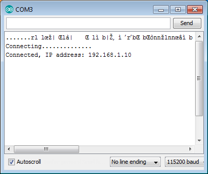
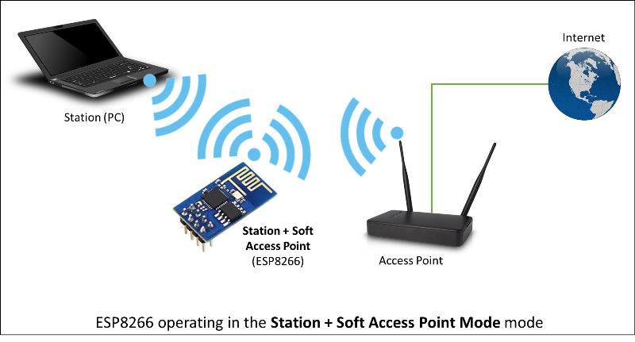
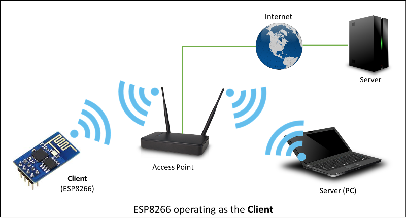
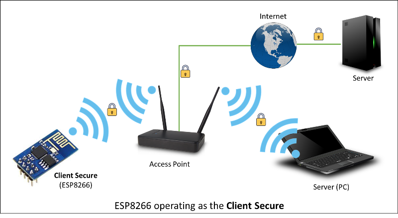
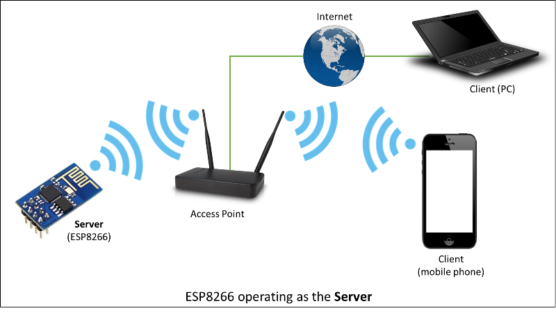
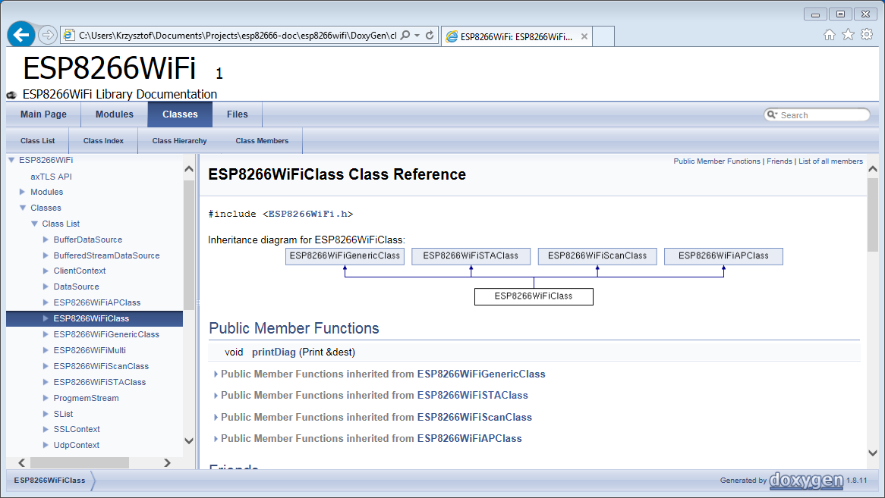
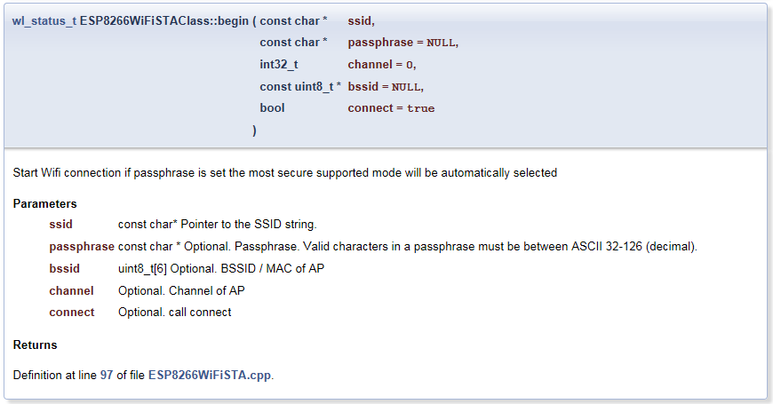

ESP8266 is all about Wi-Fi. If you are eager to connect your new ESP8266 module to Wi-Fi network to start sending and receiving data, this is a good place to start. If you are looking for more in depth details of how to program specific Wi-Fi networking functionality, you are also in the right place.


## Table of Contents
  * [Introduction](#introduction)
    * [Quick Start](#quick-start)
    * [Who is Who](#who-is-who)
  * [Class Description](class-description)
    * [Station](#station)
    * [Soft Access Point](#soft-access-point)
    * [Scan](#scan)
    * [Client](#client)
    * [Client Secure](#client-secure)
    * [Server](#server)
    * [UDP](#udp)
    * [Generic](#generic)
  * [Diagnostics](#diagnostics)
    * [Check Return Codes](#check-return-codes)
    * [Use printDiag](#use-printdiag)
    * [Enable Wi-Fi Diagnostic](#enable-wi-fi-diagnostic)
    * [Enable Debugging in IDE](#enable-debugging-in-ide)
  * [What's Inside?](#whats-inside)


## Introduction

The [Wi-Fi library for ESP8266](https://github.com/esp8266/Arduino/tree/master/libraries/ESP8266WiFi) has been developed basing on [ESP8266 SDK](http://bbs.espressif.com/viewtopic.php?f=51&t=1023), using naming convention and overall functionality philosophy of [Arduino WiFi library](https://www.arduino.cc/en/Reference/WiFi). Over time the wealth Wi-Fi features ported from ESP9266 SDK to [esp8266 / Adruino](https://github.com/esp8266/Arduino) outgrow [Arduino WiFi library](https://www.arduino.cc/en/Reference/WiFi) and it became apparent that we need to provide separate documentation on what is new and extra.

This documentation will walk you through several classes, methods and properties of [ESP8266WiFi](https://github.com/esp8266/Arduino/tree/master/libraries/ESP8266WiFi) library. If you are new to C++ and Arduino, don't worry. We will start from general concepts and then move to detailed description of members of each particular class including usage examples.

The scope of functionality offered by [ESP8266WiFi](https://github.com/esp8266/Arduino/tree/master/libraries/ESP8266WiFi) library is quite extensive and therefore this description has been broken up into separate documents marked with :arrow_right:.


### Quick Start

Hopefully you are already familiar how to load [Blink.ino](https://github.com/esp8266/Arduino/blob/master/libraries/esp8266/examples/Blink/Blink.ino) sketch to ESP8266 module and get the LED blinking. If not, please check [this tutorial](https://learn.adafruit.com/adafruit-huzzah-esp8266-breakout/using-arduino-ide) by Adafruit or [another great tutorial](https://learn.sparkfun.com/tutorials/esp8266-thing-hookup-guide/introduction) developed by Sparkfun.

To hook up ESP module to Wi-Fi (like hooking up a mobile phone to a hot spot), you need just couple of lines of code:

```cpp
#include <ESP8266WiFi.h>

void setup()
{
  Serial.begin(115200);
  Serial.println();

  WiFi.begin("network-name", "pass-to-network");
  
  Serial.print("Connecting");
  while (WiFi.status() != WL_CONNECTED)
  {
    delay(500);
    Serial.print(".");
  }
  Serial.println();
  
  Serial.print("Connected, IP address: ");
  Serial.println(WiFi.localIP());
}

void loop() {}
```

In the line `WiFi.begin("network-name", "pass-to-network")` replace `network-name` and `pass-to-network` with name and password to the Wi-Fi network you like to connect. Then upload this sketch to ESP module and open serial monitor. You should see something like:



How does it work? In the first line of sketch `#include <ESP8266WiFi.h>` we are including [ESP8266WiFi](https://github.com/esp8266/Arduino/tree/master/libraries/ESP8266WiFi) library. This library provides ESP8266 specific Wi-Fi routines we are calling to connect to network.

Actual connection to Wi-Fi is initialized by calling:

```cpp
WiFi.begin("network-name", "pass-to-network");
```

Connection process can take couple of seconds and we are checking for this to complete in the following loop:

```cpp
  while (WiFi.status() != WL_CONNECTED)
  {
    delay(500);
    Serial.print(".");
  }
```

The `while()` loop will keep looping while `WiFi.status()` is other than `WL_CONNECTED`. The loop will exit only if the status changes to `WL_CONNECTED`.

The last line will then print out IP address assigned to ESP module by [DHCP](http://whatismyipaddress.com/dhcp):

```cpp
Serial.println(WiFi.localIP());
```

If you don't see the last line but just more and more dots `.........`, then likely name or password to the Wi-Fi network in sketch is entered incorrectly. Verify name and password by connecting from scratch to this Wi-Fi a PC or a mobile phone.

*Note:* if connection is established, and then lost for some reason, ESP will automatically reconnect to last used access point once it is again back on-line. This will be done automatically by Wi-Fi library, without any user intervention.

That's all you need to connect ESP8266 to Wi-Fi. In the following chapters we will explain what cool things can be done by ESP once connected. 


### Who is Who

Devices that connect to Wi-Fi network are called stations (STA). Connection to Wi-Fi is provided by an access point (AP), that acts as a hub for one or more stations. The access point on the other end is connected to a wired network. An access point is usually integrated with a router to provide access from Wi-Fi network to the internet. Each access point is recognized by a SSID (**S**ervice **S**et **ID**entifier), that essentially is the name of network you select when connecting a device (station) to the Wi-Fi. 

ESP8266 module can operate as a station, so we can connect it to the Wi-Fi network. It can also operate as a soft access point (soft-AP), to establish its own Wi-Fi network. Therefore we can connect other stations to such ESP module. ESP8266 is also able to operate both in station and soft access point mode. This provides possibility of building e.g. [mesh networks](https://en.wikipedia.org/wiki/Mesh_networking).



The [ESP8266WiFi](https://github.com/esp8266/Arduino/tree/master/libraries/ESP8266WiFi) library provides wide collection of C++ [methods](https://en.wikipedia.org/wiki/Method_(computer_programming)) (functions) and [properties](https://en.wikipedia.org/wiki/Property_(programming)) to configure and operate an ESP8266 module in station and / or soft access point mode. They are described in the following chapters. 


## Class Description

The [ESP8266WiFi](https://github.com/esp8266/Arduino/tree/master/libraries/ESP8266WiFi) library is broken up into several classes. In most of cases, when writing the code, user is not concerned with this classification. We are using it to break up description of this library into more manageable pieces.


Chapters below describe all function calls ([methods](https://en.wikipedia.org/wiki/Method_(computer_programming)) and [properties](https://en.wikipedia.org/wiki/Property_(programming)) in C++ terms) listed in particular classes of [ESP8266WiFi](https://github.com/esp8266/Arduino/tree/master/libraries/ESP8266WiFi). Description is illustrated with application examples and code snippets to show how to use functions in practice. Most of this information is broken up into separate documents. Please follow :arrow_right: to access them. 


### Station

Station (STA) mode is used to get ESP module connected to a Wi-Fi network established by an access point. 


Station class has several features to facilitate management of Wi-Fi connection. In case the connection is lost, ESP8266 will automatically reconnect to the last used access point, once it is again available.  The same happens on module reboot. This is possible since ESP is saving credentials to last used access point in flash (non-volatile) memory. Using the saved data ESP will also reconnect if sketch has been changed but code does not alter the Wi-Fi mode or credentials.

[Station Class documentation :arrow_right:](station-class.md) : [begin](station-class.md#begin) | [config](station-class.md#config) | [reconnect](station-class.md#reconnect) | [disconnect](station-class.md#disconnect) | [isConnected](station-class.md#isconnected) | [setAutoConnect](station-class.md#setautoconnect) | [getAutoConnect](station-class.md#getautoconnect) | [setAutoReconnect](station-class.md#setautoreconnect) | [waitForConnectResult](station-class.md#waitforconnectresult) | [macAddress](station-class.md#macAddress) | [localIP](station-class.md#localip) | [subnetMask](station-class.md#subnetmask) | [gatewayIP](station-class.md#gatewayip) | [dnsIP](station-class.md#dnsip) | [hostname](station-class.md#hostname) | [status](station-class.md#status) | [SSID](station-class.md#ssid) | [psk](station-class.md#psk) | [BSSID](station-class.md#bssid) | [RSSI](station-class.md#rssi) | [WPS](station-class.md#wps) | [Smart Config](station-class.md#smart-config)

Check out separate section with [examples :arrow_right:](station-examples.md)


### Soft Access Point

An [access point (AP)](https://en.wikipedia.org/wiki/Wireless_access_point) is a device that provides access to Wi-Fi network to other devices (stations) and connects them further to a wired network. ESP8266 can provide similar functionality except it does not have interface to a wired network. Such mode of operation is called soft access point (soft-AP). The maximum number of stations connected to the soft-AP is five.


The soft-AP mode is often used and an intermediate step before connecting ESP to a Wi-Fi in a station mode. This is when SSID and password to such network is not known upfront. ESP first boots in soft-AP mode, so we can connect to it using a laptop or a mobile phone. Then we are able to provide credentials to the target network. Once done ESP is switched to the station mode and can connect to the target Wi-Fi.

Another handy application of soft-AP mode is to set up [mesh networks](https://en.wikipedia.org/wiki/Mesh_networking). ESP can operate in both soft-AP and Station mode so it can act as a node of a mesh network.

[Soft Access Point Class documentation :arrow_right:](soft-access-point-class.md) : [softAP](soft-access-point-class.md#softap) | [softAPConfig](soft-access-point-class.md#softapconfig) | [softAPdisconnect](soft-access-point-class.md#softapdisconnect) | [softAPgetStationNum](soft-access-point-class.md#softapgetstationnum) | [softAPIP](soft-access-point-class.md#softapip) | [softAPmacAddress](soft-access-point-class.md#softapmacaddress)

Check out separate section with [examples :arrow_right:](soft-access-point-examples.md)


### Scan

To connect a mobile phone to a hot spot, you typically open Wi-Fi settings app, list available networks and pick the hot spot you need. Then enter a password (or not) and you are in. You can do the same with ESP. Functionality of scanning for, and listing of available networks in range is implemented by the Scan Class.

[Scan Class documentation :arrow_right:](scan-class.md) : [scanNetworks](scan-class.md#scannetworks) | [scanNetworksAsync](scan-class.md#scannetworksasync) | [scanComplete](scan-class.md#scancomplete) | [scanDelete](scan-class.md#scandelete) | [SSID](scan-class.md#ssid) | [encryptionType](scan-class.md#encryptiontype) | [BSSID](scan-class.md#bssid) | [BSSIDstr](scan-class.md#bssidstr) | [channel](scan-class.md#channel) | [isHidden](scan-class.md#ishidden) | [getNetworkInfo](scan-class.md#getnetworkinfo)

Check out separate section with [examples :arrow_right:](scan-examples.md)


### Client

The Client class creates [clients](https://en.wikipedia.org/wiki/Client_(computing)) that can access services provided by [servers](https://en.wikipedia.org/wiki/Server_(computing)) in order to send, receive and process data.



Check out separate section with [examples :arrow_right:](client-examples.md) / [list of functions :arrow_right:](client-class.md)


### Client Secure

The Client Secure is an extension of [Client Class](#client) where connection and data exchange with servers is done using a [secure protocol](https://en.wikipedia.org/wiki/Transport_Layer_Security). It supports [TLS 1.1](https://en.wikipedia.org/wiki/Transport_Layer_Security#TLS_1.1). The [TLS 1.2](https://en.wikipedia.org/wiki/Transport_Layer_Security#TLS_1.2) is not supported.



Secure applications have additional memory (and processing) overhead due to the need to run cryptography algorithms. The stronger the certificate's key, the more overhead is needed. In practice it is not possible to run more than a single secure client at a time. The problem concerns RAM memory we can not add, the flash memory size is usually not the issue. If you like to learn how [client secure library](https://github.com/esp8266/Arduino/blob/master/libraries/ESP8266WiFi/src/WiFiClientSecure.h) has been developed, access to what servers have been tested, and how memory limitations have been overcame, read fascinating issue report [#43](https://github.com/esp8266/Arduino/issues/43).

Check out separate section with [examples :arrow_right:](client-secure-examples.md) / [list of functions :arrow_right:](client-secure-class.md)


### Server

The Server Class creates [servers](https://en.wikipedia.org/wiki/Server_(computing)) that provide functionality to other programs or devices, called [clients](https://en.wikipedia.org/wiki/Client_(computing)). 



Clients connect to sever to send and receive data and access provided functionality.

Check out separate section with [examples :arrow_right:](server-examples.md) / [list of functions :arrow_right:](server-class.md)


### UDP

The UDP Class enables the [User Datagram Protocol (UDP)](https://en.wikipedia.org/wiki/User_Datagram_Protocol) messages to be sent and received. The UDP uses a simple "fire and forget" transmission model with no guarantee of delivery, ordering, or duplicate protection. UDP provides checksums for data integrity, and port numbers for addressing different functions at the source and destination of the datagram.

Check out separate section with [examples :arrow_right:](udp-examples.md) / [list of functions :arrow_right:](udp-class.md)


### Generic

There are several functions offered by ESP8266's [SDK](http://bbs.espressif.com/viewtopic.php?f=51&t=1023) and not present in [Arduino WiFi library](https://www.arduino.cc/en/Reference/WiFi). If such function does not fit into one of classes discussed above, it will likely be in Generic Class. Among them is handler to manage Wi-Fi events like connection, disconnection or obtaining an IP, Wi-Fi mode changes, functions to manage module sleep mode, hostname to an IP address resolution, etc.

Check out separate section with [examples :arrow_right:](generic-examples.md) / [list of functions :arrow_right:](generic-class.md)


## Diagnostics

There are several techniques available to diagnose and troubleshoot issues with getting connected to Wi-Fi and keeping connection alive.


### Check Return Codes

Almost each function described in chapters above returns some diagnostic information.

Such diagnostic may be provided as a simple `boolean` type `true' or `false` to indicate operation result. You may check this result as described in examples, for instance:

```cpp
Serial.printf("Wi-Fi mode set to WIFI_STA %s\n", WiFi.mode(WIFI_STA) ? "" : "Failed!");
```

Some functions provide more than just a binary status information. A good example is `WiFi.status()`.

```cpp
Serial.printf("Connection status: %d\n", WiFi.status());
```

This function returns following codes to describe what is going on with Wi-Fi connection:
  * 0 : `WL_IDLE_STATUS` when Wi-Fi is in process of changing between statuses
  * 1 : `WL_NO_SSID_AVAIL`in case configured SSID cannot be reached
  * 3 : `WL_CONNECTED` after successful connection is established
  * 4 : `WL_CONNECT_FAILED` if password is incorrect
  * 6 : `WL_DISCONNECTED` if module is not configured in station mode 

It is a good practice to display and check information returned by functions. Application development and troubleshooting will be easier with that.


### Use printDiag

There is a specific function available to print out key Wi-Fi diagnostic information:

```cpp
WiFi.printDiag(Serial);
```

A sample output of this function looks as follows:

```
Mode: STA+AP
PHY mode: N
Channel: 11
AP id: 0
Status: 5
Auto connect: 1
SSID (10): sensor-net
Passphrase (12): 123!$#0&*esP
BSSID set: 0
```

Use this function to provide snapshot of Wi-Fi status in these parts of application code, that you suspect may be failing.


### Enable Wi-Fi Diagnostic 

By default the diagnostic output from Wi-Fi libraries is disabled when you call `Serial.begin`. To enable debug output again, call `Serial.setDebugOutput(true)`. To redirect debug output to `Serial1` instead, call `Serial1.setDebugOutput(true)`. For additional details regarding diagnostics using serial ports please refer to [documentation](https://github.com/esp8266/Arduino/blob/master/doc/reference.md).

Below is an example of output for sample sketch discussed in [Quick Start](#quick-start) above with `Serial.setDebugOutput(true)`:

```
Connectingscandone
state: 0 -> 2 (b0)
state: 2 -> 3 (0)
state: 3 -> 5 (10)
add 0
aid 1
cnt 

connected with sensor-net, channel 6
dhcp client start...
chg_B1:-40
...ip:192.168.1.10,mask:255.255.255.0,gw:192.168.1.9
.
Connected, IP address: 192.168.1.10
```

The same sketch without `Serial.setDebugOutput(true)` will print out only the following:
```
Connecting....
Connected, IP address: 192.168.1.10
```


### Enable Debugging in IDE

Arduino IDE provides convenient method to [enable debugging](https://github.com/esp8266/Arduino/blob/master/doc/Troubleshooting/debugging.md) for specific libraries.


## What's Inside?

If you like to analyze in detail what is inside of the ESP8266WiFi library, go directly to the [ESP8266WiFi](https://github.com/esp8266/Arduino/tree/master/libraries/ESP8266WiFi/src) folder of esp8266 / Arduino repository on the  GitHub. 

To make the analysis easier, rather than looking into individual header or source files, use one of free tools to automatically generate documentation. The class index in chapter [Class Description](class-description) above has been prepared in no time using great [Doxygen](http://www.stack.nl/~dimitri/doxygen/), that is the de facto standard tool for generating documentation from annotated C++ sources.



The tool crawls through all header and source files collecting information from formatted comment blocks.  If developer of particular class annotated the code, you will see it like in examples below. 




If code is not annotated, you will still see the function prototype including types of arguments, and can use provided links to jump straight to the source code to check it out on your own. Doxygen provides really excellent navigation between members of library.

by Doxygen")

Several classes of [ESP8266WiFi](https://github.com/esp8266/Arduino/tree/master/libraries/ESP8266WiFi) are not annotated. When preparing this document, [Doxygen](http://www.stack.nl/~dimitri/doxygen/) has been tremendous help to quickly navigate through almost 30 files that make this library.

