[FAQ list :back:](readme.md)


## I am getting "espcomm_sync failed" error when trying to upload my ESP. How to resolve this issue?


- [Introduction](#Introduction)
- [Initial Checks](#initial-checks)
- [Advanced Checks](#advanced-checks)
- [Reset Methods](#reset-methods)
  - [Ck](#ck)
  - [Nodemcu](#nodemcu)
- [I'm Stuck](#im-stuck)
- [Conclusion](#conclusion)


### Introduction

This message indicates issue with uploading ESP module over a serial connection. There are couple of possible causes, that depend on the type of module, if you use separate USB to serial converter, what parameters are selected for upload, etc. As result there is no single answer on the root cause. To find it out you may need to complete couple of troubleshooting steps. 

> Note: If you are just starting with ESP, to reduce potential issues with uploading, select ESP board with integrated USB to serial converter. This will considerably reduce number of user depended factors or configuration settings that influence upload process. 

Example boards with USB to serial converter build in, that will make your initial project development easier, are shown below.

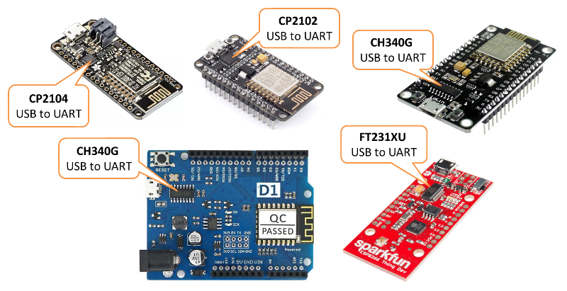

If you are using a Generic ESP8266 module, separate USB to serial converter and connect them by yourself, please make sure you have the following three things right:
  1. Module is provided with enough power,
  2. GPIO0, GPIO15 and CH_PD are connected using pull up / pull down resistors,
  3. Module is put into boot loader mode.
  
For specific details please refer to section on [Generic ESP8266 modules](../boards.md#generic-esp8266-modules). Example modules without USB to serial converter on board are shown below.

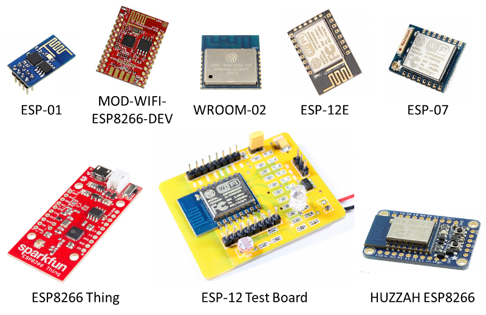


### Initial Checks

In order to troubleshoot "espcomm_sync failed" error, please proceed step by step through the checklist below. This list is organized starting with most common and simple to more complex issues.

  1. Start with reading exact message displayed in debug window of Arduino IDE. In many cases it provides direct information where the issue is. 
  
  
  
  For instance message above suggests that Arduino IDE is unable to open a serial port COM3. Check if you have selected port where your module is connected to.
  
  
  
  2. If a module is connected to the serial port but not responding as a valid ESP8266 device, the message will read slightly different (see below). If you have other modules connected to your PC, make sure that you are uploading code to ESP8266 and not to e.g. Arduino UNO.

  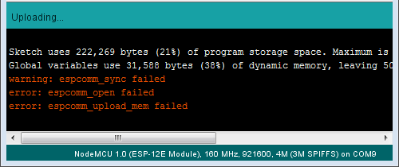
  
  3. To have your PC talking to ESP, select exact ESP type in upload menu. If selection is incorrect then the upload may fail.
  
  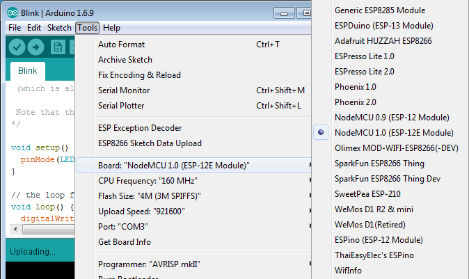
  
  Basing on selected board type, Arduino IDE will apply specific "reset method" to enter the board into boot loading mode. Reset methods are board specific. Some boards do not have the h/w in place to support reset by Arduino IDE. If this is the case, you need to enter such board into boot loading mode manually.
  
  4. Upload may be also failing due to too high speed. If you have long or poor quality USB cable, try reducing selection under *Upload Speed*.
  
  


### Advanced Checks

  1. If you are still facing issues, test if module is indeed entering the boot loading mode. You can do it by connecting secondary USB to serial converter and checking the message displayed. Attach RX and GND pins of converter to TX and GND pin of ESP as shown on example below ([get fzz source](pictures/a01-secondary-serial-hookup.fzz)).
  
  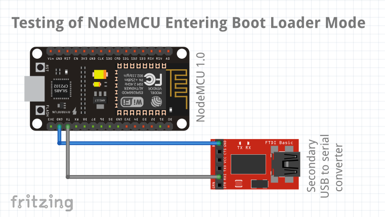
  
  Then open a terminal at 74880 baud, and look what message is reported when ESP is being reset for programming. Correct message looks as follows:

  ```
   ets Jan  8 2013,rst cause:2, boot mode:(1,7)
  ```

  If you see similar message but different values then decode them using [Boot Messages and Modes](../boards.md#boot-messages-and-modes). The key information is contained in first digit / three right-most bits of the boot mode message as shown below.
  
   
  
  For instance message ``` boot mode (3,3) ``` indicates that pins GPIO2 and GPIO0 are set HIGH and GPIO15 is set LOW. This is configuration for [normal operation](../boards.md#minimal-hardware-setup-for-running-only) of module (to execute application from flash), not for [boot loading](../boards.md#minimal-hardware-setup-for-bootloading-only) (flash programming).
  
  > Note:  Without having this step right you will not be able to upload your module over a serial port.

  2. You have confirmed that module is in boot loading mode but upload still fails. If you are using external USB to serial converter, then check if it operates correctly by looping it back. This is quite simple check. Just connect TX and RX of your converter together like on picture below. Then open Serial Monitor and type some characters. If everything is fine, then you should see what you type immediately printed back on the monitor. For an ESP with USB to serial converter on board, this check may involve breaking some PCB traces. I would not do it unless being desperate. Instead try steps below.

  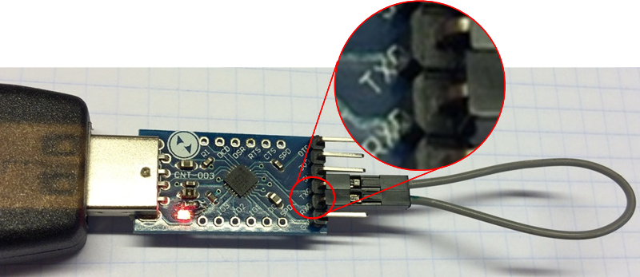

  3. Next step to try, if not done already, is checking detailed debug messages. Go to *File > Preferences*, enable *Show verbose output during: upload* and try uploading again. For successful upload this log should look similar to example shown below:

  ```
  C:\Users\Krzysztof\AppData\Local\Arduino15\packages\esp8266\tools\esptool\0.4.8/esptool.exe -vv -cd ck -cb 115200 -cp COM3 -ca 0x00000 -cf C:\Users\KRZYSZ~1\AppData\Local\Temp\build7e44b372385012e74d64fb272d24b802.tmp/Blink.ino.bin 
  esptool v0.4.8 - (c) 2014 Ch. Klippel <ck@atelier-klippel.de>
      setting board to ck
      setting baudrate from 115200 to 115200
      setting port from COM1 to COM3
      setting address from 0x00000000 to 0x00000000
      espcomm_upload_file
      espcomm_upload_mem
      setting serial port timeouts to 1000 ms
  opening bootloader
  resetting board
  trying to connect
      flush start
      setting serial port timeouts to 1 ms
      setting serial port timeouts to 1000 ms
      flush complete
      espcomm_send_command: sending command header
      espcomm_send_command: sending command payload
      read 0, requested 1
  trying to connect
      flush start
      setting serial port timeouts to 1 ms
      setting serial port timeouts to 1000 ms
      flush complete
      espcomm_send_command: sending command header
      espcomm_send_command: sending command payload
      espcomm_send_command: receiving 2 bytes of data
      espcomm_send_command: receiving 2 bytes of data
      espcomm_send_command: receiving 2 bytes of data
      espcomm_send_command: receiving 2 bytes of data
      espcomm_send_command: receiving 2 bytes of data
      espcomm_send_command: receiving 2 bytes of data
      espcomm_send_command: receiving 2 bytes of data
      espcomm_send_command: receiving 2 bytes of data
  Uploading 226368 bytes from to flash at 0x00000000
      erasing flash
      size: 037440 address: 000000
      first_sector_index: 0
      total_sector_count: 56
      head_sector_count: 16
      adjusted_sector_count: 40
      erase_size: 028000
      espcomm_send_command: sending command header
      espcomm_send_command: sending command payload
      setting serial port timeouts to 15000 ms
      setting serial port timeouts to 1000 ms
      espcomm_send_command: receiving 2 bytes of data
      writing flash
  ..............................................................................................................................................................................................................................
  starting app without reboot
      espcomm_send_command: sending command header
      espcomm_send_command: sending command payload
      espcomm_send_command: receiving 2 bytes of data
  closing bootloader
      flush start
      setting serial port timeouts to 1 ms
      setting serial port timeouts to 1000 ms
      flush complete
  ```

  Upload log may be longer depending on number of connection attempts made by esptool. Analyze it for any anomalies to configuration you have selected in Arduino IDE, like different serial port, reset method, baud rate, etc. Resolve all noted differences. 


### Reset Methods

If you got to this point and still see ``` espcomm_sync failed ```, then now you need to bring in the heavy guns. 

Connect scope or logic analyzer to GPIO0, RST and RXD pins of the ESP to check what's happening.

Then compare your measurements with wave-forms collected for circuits below. They document two standard methods of resetting ESP8266 for upload, that you can select in Arduino IDE - [ck](#ck) and [nodemcu](#nodemcu). 


#### Ck
    
Circuit below has been prepared to collect wave-forms for ck reset method ([get fzz source](pictures/a01-circuit-ck-reset.fzz)). It is simpler than for [nodemcu](#nodemcu) reset and therefore often used to wire up generic ESP modules on a breadboard. Check it against your wiring when comparing your measurements against wave-forms below.
  
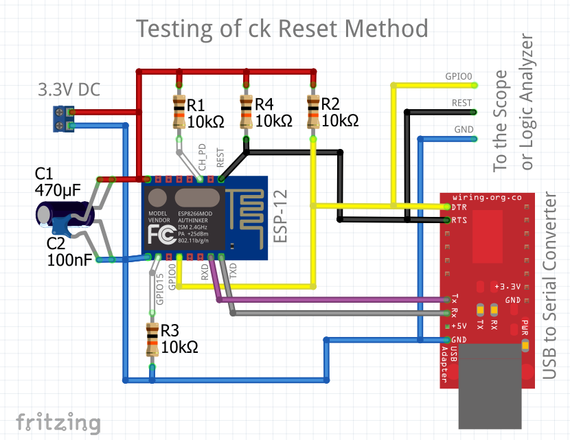

The following wave-forms below show voltage signals on GPIO0 and RST pins of the ESP board when uploading the firmware. 

Close up of ck reset method signal sequence at the beginning of upload is shown below. 

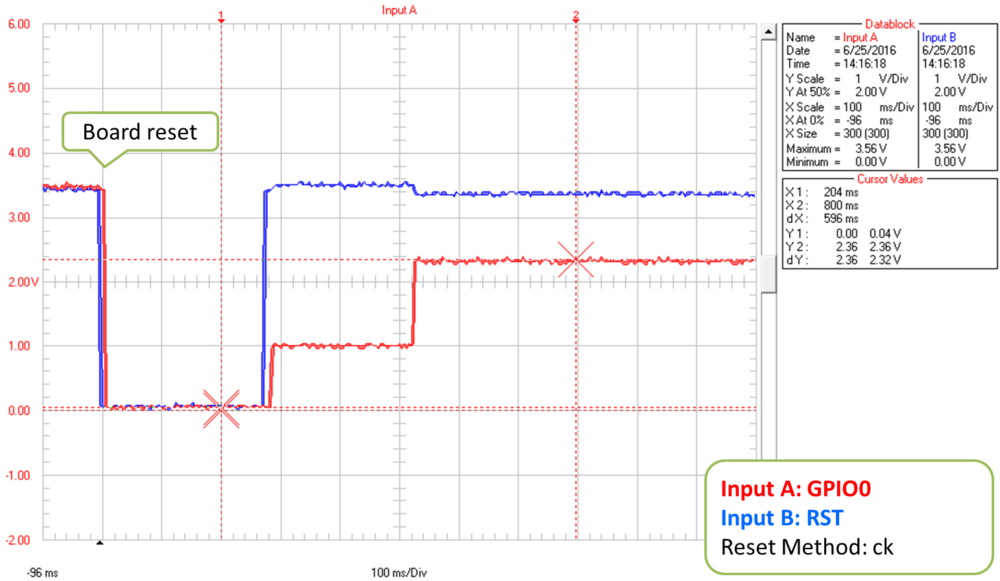

Next picture shows complete upload of [Blink.ino](https://github.com/esp8266/Arduino/blob/master/libraries/esp8266/examples/Blink/Blink.ino) example at 921600 baud. This is quite high speed, so the upload takes only about 8s.

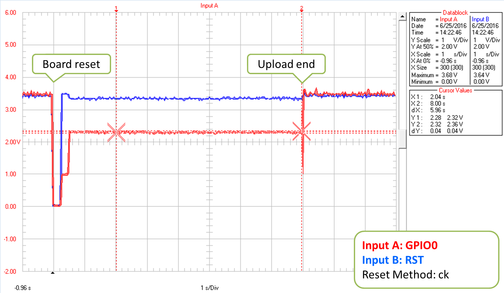

Please note that when esptool is not able to initialize upload at the first time, then it retries reset procedure. Case of one such retry is shown on wave-form below.

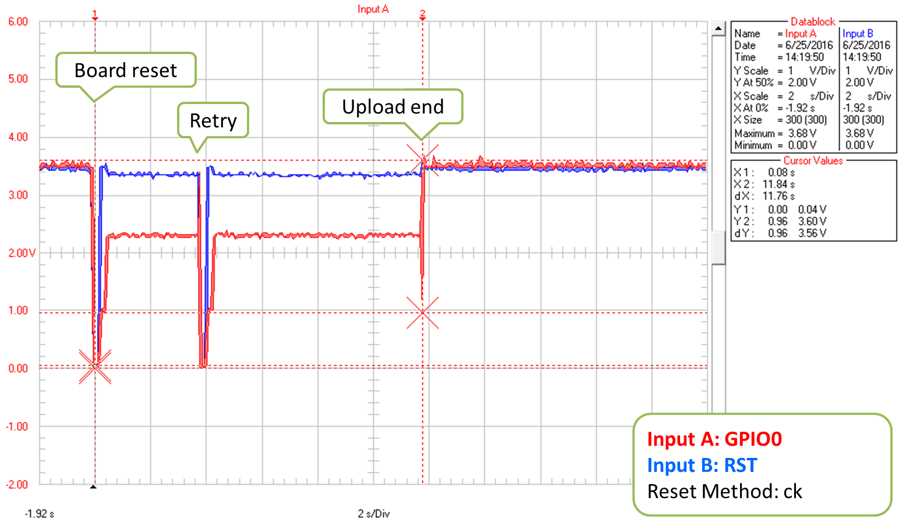

Each retry is reported in upload log as follows:
  
```
resetting board
trying to connect
    flush start
    setting serial port timeouts to 1 ms
    setting serial port timeouts to 1000 ms
    flush complete
    espcomm_send_command: sending command header
    espcomm_send_command: sending command payload
    read 0, requested 1
```

Presented circuit has one important limitation when it comes to work with Arduino IDE. After opening Serial Monitor (Ctrl-Shift-M), both RTS and DTR lines are permanently pulled down. As RTS line is connected to REST input of ESP, the module is hold in reset state / not able to run. Therefore after uploading module, you need to disconnect both lines or use different serial terminal program that is not pulling down RTS and DTR lines. Otherwise the module will get stuck waiting for releasing the REST signal and you will see nothing on the Serial Monitor.

As for different serial terminal program you can check Arduino IDE add-on [Serial Monitor for ESP8266]((https://github.com/esp8266/Arduino/issues/1360)) developed by user [@mytrain](https://github.com/mytrain) and discussed in [#1360](https://github.com/esp8266/Arduino/issues/1360). 

If you prefer external terminal program, then for Windows users we can recommend free and handy [Termite](http://www.compuphase.com/software_termite.htm).


#### Nodemcu

Nodemcu reset method is named after [NodeMCU](https://github.com/nodemcu/nodemcu-devkit) board where it has been introduced for the first time. It overcomes limitations with handling of RTS and DTR lines discussed for [ck](#ck) reset method above. 

Sample circuit to measure wave-form is shown below ([get fzz source](pictures/a01-circuit-nodemcu-reset.fzz)).
  
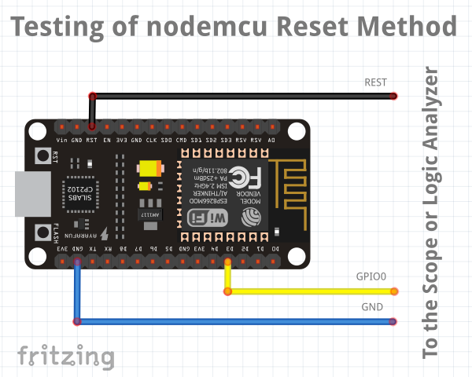
    
Close up of voltage signals on GPIO0 and RST pins at the beginning of firmware upload is shown below.

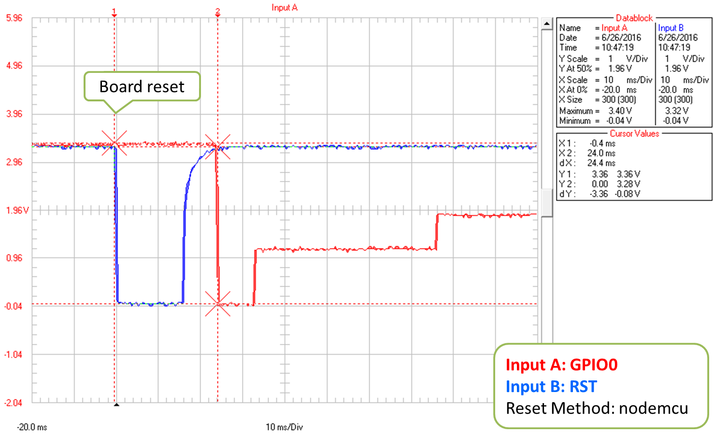

Please note that the reset sequence is about 10x shorter comparing to [ck](@ck) reset (about 25ms vs. 250ms). 

Next picture covers complete upload of [Blink.ino](https://github.com/esp8266/Arduino/blob/master/libraries/esp8266/examples/Blink/Blink.ino) example at 921600 baud. Except for difference of the reset signal sequence, the complete upload looks similar to that of [ck](@ck). 

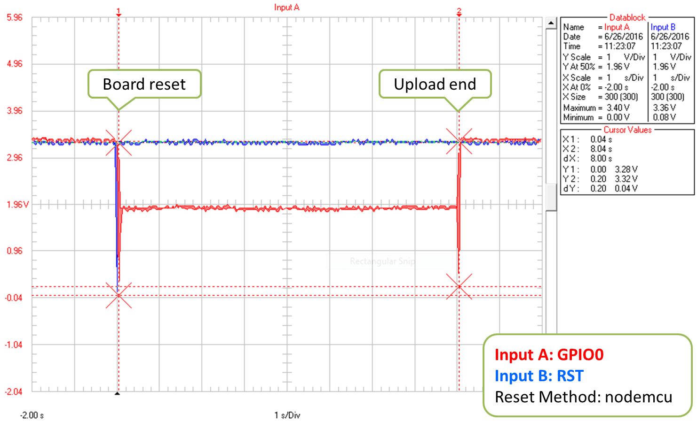

A sample wave-form below shows another upload of [Blink.ino](https://github.com/esp8266/Arduino/blob/master/libraries/esp8266/examples/Blink/Blink.ino) example at 921600 baud, but with two reset retries.

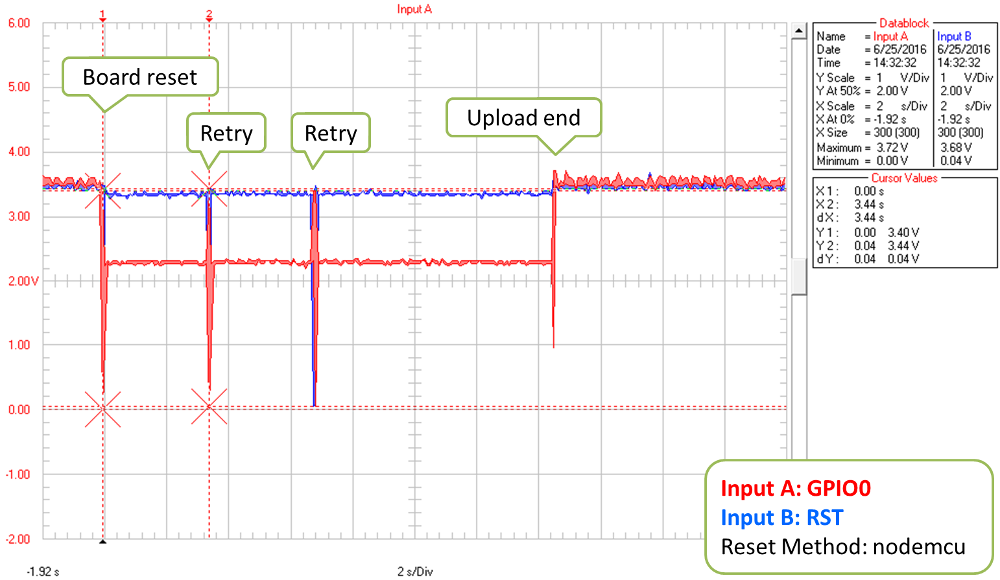

If you are interested how noodemcu reset method is implemented, then check circuit below. As indicated it does not pull to ground RTS and DTR lines once you open Serial Monitor in Arduino IDE.

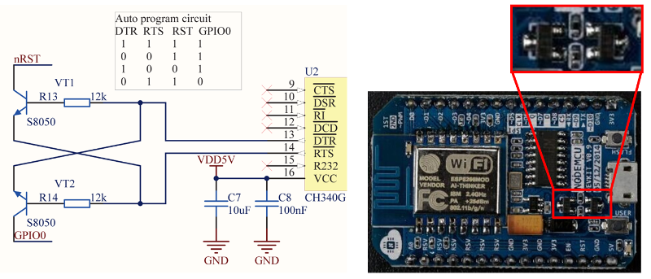

It consists of two transistors and resistors that you can locate on NodeMCU board on right. On left you can see complete circuit and the truth table how RTS and DTR signals of the serial interface are translated to RST and GPIO0 on the ESP. For more details please refer to [nodemcu](https://github.com/nodemcu/nodemcu-devkit) repository on GitHub.


### I'm Stuck

Hopefully at this point you were able to resolve ``` espcomm_sync failed ``` issue and now enjoy quick and reliable uploads of your ESP modules.

If this is still not the case, then review once more all discussed steps in the checklist below.

**Initial Checks**
* [ ] Is your module connected to serial port and visible in IDE?
* [ ] Is connected device responding to IDE? What is exact message in debug window?
* [ ] Have you selected correct ESP module type in *Board* menu? What is the selection?
* [ ] Have you tried to reduce upload speed? What speeds have you tried?

**Advanced Checks**
* [ ] What message is reported by ESP at 74880 baud when entering boot loading mode?
* [ ] Have you checked your USB to serial converter by looping it back? What is the result?
* [ ] Is your detailed upload log consistent with settings in IDE? What is the log? 

**Reset Method**
* [ ] What reset method do you use?
* [ ] What is your connection diagram? Does it match diagram in this FAQ?
* [ ] What is your wave-form of board reset? Does it match wave-form in this FAQ?
* [ ] What is your wave-form of complete upload? Does it match wave-form in this FAQ?

**Software**
* [ ] Do you use the latest stable version of [esp8266 / Arduino](https://github.com/esp8266/Arduino)? What is it?
* [ ] What is the name and version of your IDE and O/S?

If you are stuck at certain step, then post this list on [ESP8266 Community Forum](http://www.esp8266.com/) asking for support.


### Conclusion

With variety of available ESP8266 modules and boards, as well as possible connection methods, troubleshooting of upload issues may take several steps. 

If you are a beginner, then use boards with integrated power supply and USB to serial converter. Check carefully message in debug window and act accordingly. Select your exact module type in IDE and try to adjust upload speed. Check if board is indeed entering boot loading mode. Check operation of your USB to serial converter with loop back. Analyze detailed upload log for inconsistencies with IDE settings. 

Verify your connection diagram and wave-form for consistency with selected reset method.

If you get stuck, then ask [community](http://www.esp8266.com/) for support providing summary of all completed checks. 


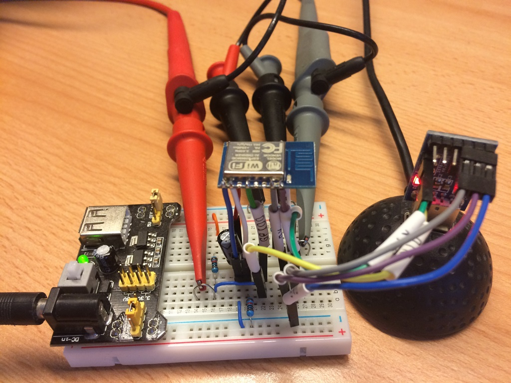

Test stand used for checking of ck reset method is shown above. 

No any ESP module has been harmed during preparation of this FAQ item.

[FAQ list :back:](readme.md)
