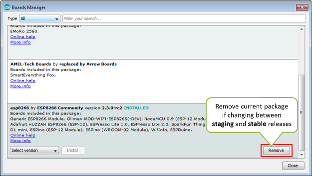
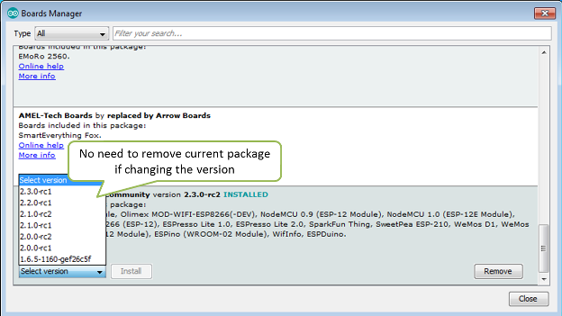
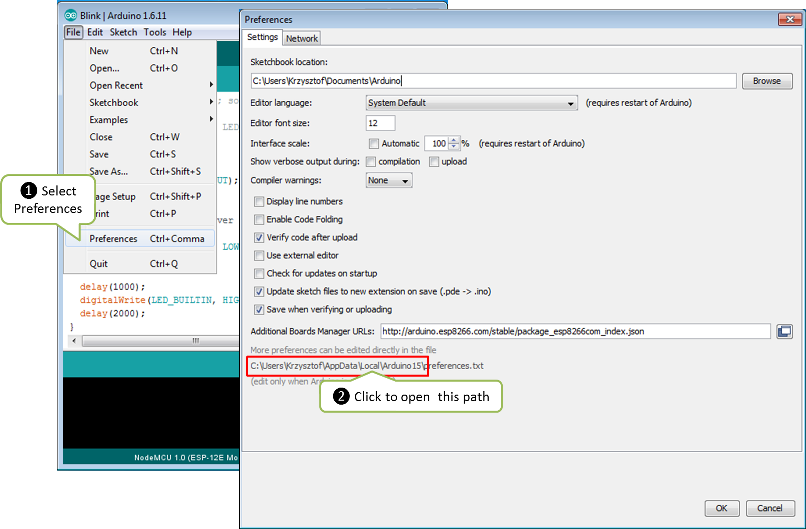
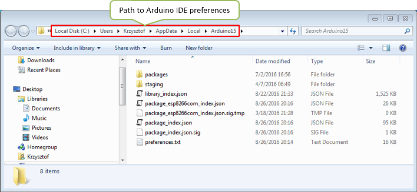

[FAQ list :back:](readme.md)


## How to resolve "Board generic (platform esp8266, package esp8266) is unknown" error?

This error may pop up after switching between [staging](https://github.com/esp8266/Arduino#staging-version-) and [stable](https://github.com/esp8266/Arduino#stable-version-) esp8266 / Arduino package installations, or after upgrading the package version.

 is unknown error")

If you face this issue, you will not be able to compile any sketch for any ESP8266 module type. 

Read below what is the error root cause or jump straight to the [resolution](#how-to-fix-it)


### The Root Cause

This issue is attributed to Arduino IDE Boards Manager not cleaning up previous package installation before a new one is applied. As this is not done, then it is user responsibility to remove previous package before applying a new one.

To prevent it from happening, if you are changing between **staging** and **stable**, first press *Remove* button to delete currently used installation.



There is no need to remove the installed package if you are changing it to another version (without switching between staging and stable).



Depending on selected module the error message is slightly different. For instance, if you choose *Generic ESP8266 Module*, it will look as follows: 

```
Board generic (platform esp8266, package esp8266) is unknown
Error compiling for board Generic ESP8266 Module.
```

Below is an example messages for [WeMos](https://github.com/esp8266/Arduino/blob/master/doc/boards.md#wemos-d1):

```
Board d1_mini (platform esp8266, package esp8266) is unknown
Error compiling for board WeMos D1 R2 & mini.
```

... and another one for [Adafruit HUZZAH](https://github.com/esp8266/Arduino/blob/master/doc/boards.md#adafruit-huzzah-esp8266-esp-12):

```
Board huzzah (platform esp8266, package esp8266) is unknown
Error compiling for board Adafruit HUZZAH ESP8266.
```

If the issue already happens, then uninstalling and re-installing the package with *Boards Manager* typically will not fix it. 

Uninstalling and re-installing the Arduino IDE will not fix it as well.

Well, OK, fine. You will be able to fix it with Boards Manager. To do so, you need to carefully go step by step through the effort of removing new and then the old package. Once done you can install again the new package. Did I mention that in between you need to change twice [JOSN](https://github.com/esp8266/Arduino#installing-with-boards-manager) in *Additional Boards Manager URLs*?

Fortunately there is a quicker and more effective fix. See below.


### How to Fix it?

Issue resolution is as simple as deleting a folder with older esp8266 / Arduino installation. 

Procedure is identical on Windows, Linux and Mac OS. The only difference is folder path. For instance, on Mac, it will be `/Users/$USER/Library/Arduino15/packages/esp8266/hardware/esp8266`. Example below shows the path for Windows.

  1. Check location of installation folder by going to *File > Preferences* (Ctrl+,). The folder location is at the very bottom of the *Preferences* window.

  

  2. Click provided link to open the folder. For Windows 7 it will look as follows:

  

  3. Navigate further down to `Arduino15\packages\esp8266\hardware\esp8266` directory. Inside you will find two folders with different esp8266 / Arduino package installations. 

  

  4. Delete the older folder. Restart Arduino IDE, select your ESP module and the error should be gone.

  Note: If you are not sure which folder to delete, then remove both of them. Restart Arduino IDE, go to *Tools > Board: > Boards Manager* and install the esp8266 / Arduino package again. Select ESP8266 module and the issue should be resolved.


### More Information

This issue has been reported quite frequently in [Issues](https://github.com/esp8266/Arduino/issues) section of esp8266 / Arduino repository. The most appreciated solution was provided by [@anhhuy0501](https://github.com/anhhuy0501) in 
[#1387](https://github.com/esp8266/Arduino/issues/1387#issuecomment-204865028).

If you are interested in more details, please refer to [#2297](https://github.com/esp8266/Arduino/issues/2297),
[#2156](https://github.com/esp8266/Arduino/issues/2156),
[#2022](https://github.com/esp8266/Arduino/issues/2022),
[#1802](https://github.com/esp8266/Arduino/issues/1802),
[#1514](https://github.com/esp8266/Arduino/issues/1514),
[#1387](https://github.com/esp8266/Arduino/issues/1387),
[#1377](https://github.com/esp8266/Arduino/issues/1377),
[#1251](https://github.com/esp8266/Arduino/issues/1251),
[#1247](https://github.com/esp8266/Arduino/issues/1247),
[#948](https://github.com/esp8266/Arduino/issues/948)

